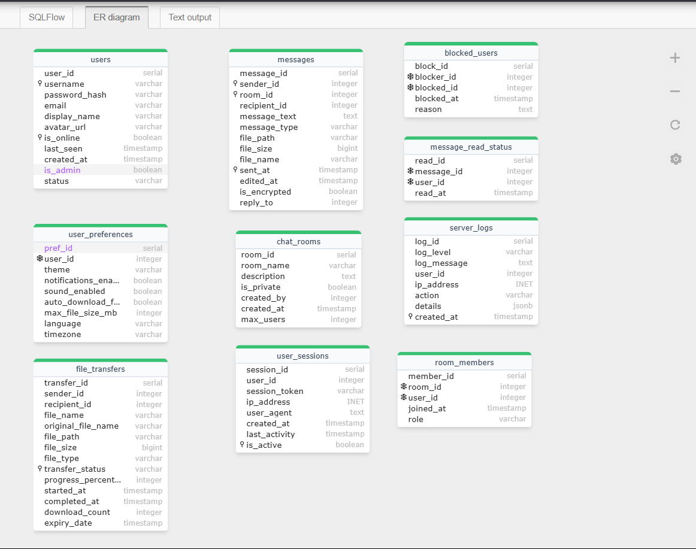
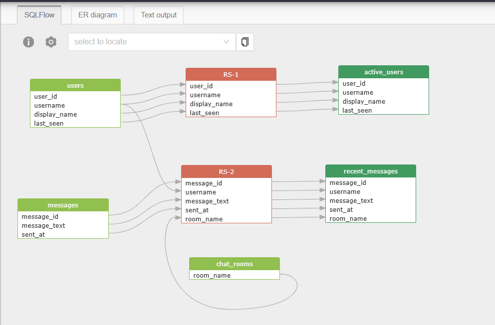

# ConnectHub

Enterprise-grade real-time communication platform built with Java and PostgreSQL. Designed for teams and organizations requiring secure messaging, file sharing, and collaboration features.


## Features

- **Real-time Messaging**: Multi-user chat with message persistence
- **User Authentication**: Secure registration and login system  
- **File Sharing**: Upload/download with progress tracking
- **Database Integration**: PostgreSQL backend with transaction management
- **Admin Controls**: Server monitoring and user management

## Architecture

Client-server architecture with PostgreSQL database for data persistence. Multi-threaded server handles concurrent connections with connection pooling.

## Database Schema

### Entity-Relationship Diagram


### Schema Visualization


## Quick Start

### Prerequisites
- Java 11+
- PostgreSQL 12+

### Setup
```bash
git clone https://github.com/OMCHOKSI108/ConnectHUB-Spring-Boot.git
cd ConnectHUB-Spring-Boot
```

### Database Configuration
```bash
# Create database and user
createdb connecthub_db
createuser connecthub_user --pwprompt

# Initialize schema
psql -U connecthub_user -d connecthub_db -f database/schema.sql
```

### Run Application
```bash
# Compile
javac -encoding UTF-8 -cp ".;postgresql-42.7.7.jar" *.java

# Start server
java -cp ".;postgresql-42.7.7.jar" EnhancedServer

# Start client (new terminal)
java -cp ".;postgresql-42.7.7.jar" EnhancedClient
```

## Usage

### Authentication
```
REGISTER username password "Display Name"
LOGIN username password
```

### Commands
| Command | Description |
|---------|-------------|
| `message` | Send public message |
| `/msg user text` | Private message |
| `/sendfile path` | Share file |
| `/users` | List online users |
| `exit` | Disconnect |

## Configuration

Edit `config/application.properties`:
```properties
db.host=localhost
db.port=5432
db.name=connecthub_db
db.username=connecthub_user
db.password=your_password

server.port=8888
server.max_clients=100
files.max_size_mb=100
```

## Technical Specifications

- **Language**: Java 11+
- **Database**: PostgreSQL with JDBC
- **Architecture**: Multi-threaded TCP server
- **Protocol**: Custom binary protocol over TCP
- **File Transfer**: Chunked with progress tracking
- **Security**: Password hashing, session management

## License

MIT License - see LICENSE file for details.
